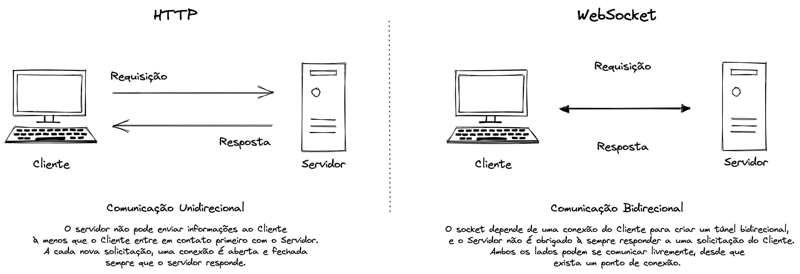

# nextjs-socketio-chat

> Aplicação de chat em tempo real utilizando Socket.io e NextJS! 🚀

## Overview

Em um determinado dia, você recebe uma demanda de um cliente que precisa visualizar dados em tempo real em um dashboard. Com o grande volume de dados que você precisará exibir na aplicação e também garantir a frequência em que esses dados sejam atualizados, logo você se dá conta de que realizar várias requisições pra sua API não parece ser uma boa estratégia... E agora?

Na verdade o que temos de "real-time" é fake! O que fazemos é passar uma "sensação" de tempo real, trafegando os dados da maneira mais rápida e performática possível.

Existem algumas tecnologias e maneiras de atingirmos isso, e uma delas é com o uso de WebSocket.

## O que é WebSocket?

- É um protocolo de comunicação bidirecional baseado em TCP;
- A relação com o protocolo HTTP é somente ao realizarmos o handshake com o Cliente e o Servidor;
- Seu uso é ideal para aplicações que precisem trafegar determinados dados em tempo real e com baixa latência: chats, jogos e etc;
- Baseado na numa arquitetura de eventos.

HTTP e WebSocket ambos são protocolos usados ​​na comunicação cliente-servidor.
A melhor maneira de entender como o WebSocket funciona, é comparando ele com o protocolo HTTP.

## HTTP vs WebSocket

O protocolo HTTP funciona com uma **Comunicação Unidirecional**, toda vez que o Cliente precisa de uma informação do Servidor (onde ficam armazenados os dados dos usuários por exemplo), uma requisição é enviada do Cliente para o Servidor, e o Servidor devolve os dados com uma resposta à aquela requisição. Uma vez que isso ocorre, a nossa conexão é encerrada, ou seja, caso precisemos de uma outra informação esse mesmo fluxo se repete.

Já com o WebSocket, a conexão criada entre Cliente e Servidor é de maneira contínua (através de um túnel de **Comunicação Bidirecional**), sem precisarmos abrir novas conexões toda vez que necessitarmos de uma nova informação. Por conta disso, a velocidade de tráfego também acaba sendo maior que o protocolo HTTP.

Ele é baseado numa arquitetura de eventos onde o Cliente e o Servidor emitem e recebem eventos um pro outro, se comunicando livremente.
